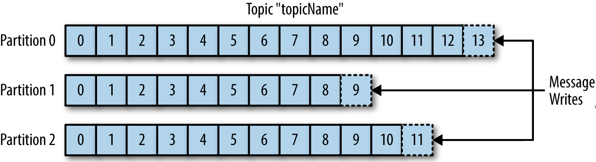

# What is Kafka

  * Scalable, Persistent Message Queue
  
## Message Queue

1. Decouple source and target systems

   
   * It is like messaging instead of phone calls - 
   the message will eventually reach the recipient even if it is not available at the moment.
   
1. Reduce integration complexity

   
   * Instead of integrating each app with all others, it is enough to implement Kafka integration.
   * Each target system (consumer) is tracking its own progress.

## Persistent

   * Target system can be unavailable for hours (days).
   * Messages are stored on disk. Retention time can be set for each topic (default is 7 days).

## Scalable

   * Designed with scalability in mind. How to process and increasing number of messages? (millions of messages / second)
   
### Topic
  * A topic contains all messages that belong together from a logical point of view. 
  * Kafka does not impose any restrictions on the content of the topic. 
  * The messages within a topic usually have the same structure, but this is not a rule. 
  In some cases it makes sense to have messages with different structure in the same  topic.

### Partitioning
   * Distribute the data across multiple machines (partitioning)  
   * Partition count is a property of the topic.
   
   * Machines that hold the data are called Brokers.
   * All brokers (together with the Zookeeper nodes) for a Kafka Cluster.
   
   
### Replication
   * The more nodes we have, the more likely is to have a breakdown
   
   * Each partition has a leader.
   * Zookeeper is responsible (among other things) for leader re-election in case of a failure.

# Take away notions
  * Topic
  * Partition
  * Broker
  * Zookeeper
  * Producer
  * Consumer

# Command-line tools

| Operation | Standard tooling | Kafkacat |
| ---       | ---              |  -----   |
| Describe topics  | `kafka-topics --describe` | `kafkacat -L` |
| Consume messages | `kafka-console-consumer`  | `kafkacat -C` |
| Produce messages | `kafka-console-producer`  | `kafkacat -P` |

## Manage topics

### Using `kafka-topics`

```bash
# Create topic
kafka-topics --bootstrap-server localhost:9092 \
    --create \
    --topic test2 \
    --partitions 2 \
    --replication-factor 2
    
# List topics
kafka-topics --bootstrap-server localhost:9092 --list
    
# Describe topics
kafka-topics --bootstrap-server localhost:9092 --describe

# Describe topic
kafka-topics --bootstrap-server localhost:9092 --describe \
    --topic test2
```

### Using `kafkacat`

```bash
# Describe topics
kafkacat -b localhost:9092 -L

# Describe topic
kafkacat -b localhost:9092 -L -t test2
```

## Produce messages

```bash
# Using the official tooling `kafka-console-producer`
cat content.txt | kafka-console-producer \
    --broker-list localhost:9092 \
    --topic test
    
# Using `kafkacat`
kafkacat -b localhost:9092 -P -t test -l content.txt
```

## Consume messages

```bash
# Using the official tooling
kafka-console-consumer \
    --bootstrap-server localhost:9092 \
    --topic test \
    --from-beginning
    
# Using kafkacat
kafkacat -b localhost:9092 -t test

# Using `kafkacat`, exitting when finished
kafkacat -b localhost:9092 -t test -e
```

# Homework

* Watch the following lectures (15 mins total):
   - [Apache Kafka in 5 minutes](https://www.linkedin.com/learning/learn-apache-kafka-for-beginners/apache-kafka-in-five-minutes).
   - [Topics, Partitions and Offsets](https://www.linkedin.com/learning/learn-apache-kafka-for-beginners/topics-partitions-and-offsets).
   - [Brokers and Topics](https://www.linkedin.com/learning/learn-apache-kafka-for-beginners/brokers-and-topics)
   
* Exercise
   - Setup a kafka cluster on your machine (you can use the dockerized environment).
   - Create a topic `entries` with 2 partitions and replication factor of two.
   - Import all lines from `entries.json` into this new topic.
   - Read all lines from this topic.
