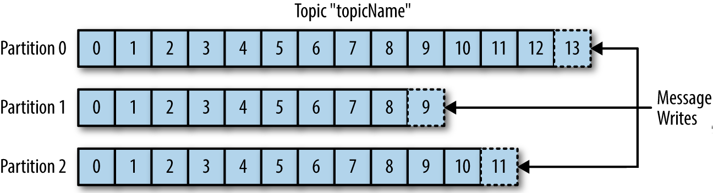

# Session #2

Deep dive in producers and consumers

## Looking back to Session #1

### Notions

* Topic, Partition, Replication
* Broker, Zookeeper
* Producer, Consumer
* Scalability

### Topic partitions revisited

* Distribute the data across multiple machines  

* Partition count is a property of the topic.

## Produce messages like a boss ;)

```bash
# Create topic test2
kafka-topics --bootstrap-server localhost:9092 \
    --create \
    --topic test2 \
    --partitions 2 \
    --replication-factor 2

# Consume topic
kafkacat -b localhost:9092 -t test2 -C

# Produce messages (in a different window)
kafkacat -b localhost:9092 -t test2 -P
```

If you entered a few lines, you noticed that messages are distributed `randomly` across partitions.

### Introducing message keys

```bash
# Consume topic further
kafkacat -b localhost:9092 -t test2 -C

# Produce messages (in a different window)
# Enter key,value pairs
kafkacat -b localhost:9092 -t test2 -P -K ','
```

Messages with the same key go to the same partition.
- Keys are not unique, they just control partitioning.
- Message ordering is guaranteed only within the same partition.
- Messages with the same key will be in order.

## Consume messages like a pro ;)

### Display keys and other properties

```bash
# Consume messages with keys
kafkacat -b localhost:9092 -t test2 -C -K '\t' -e

# Or simply use the json format:
kafkacat -b localhost:9092 -t test2 -C -J

# pretty
kafkacat -b localhost:9092 -t test2 -CJ | jq .
```

### Lookup messages by timestamp or offset

```bash
# Messages up to a timestamp
kafkacat -b localhost:9092 -t test2 -CJ -o e@1582124859672

# Messages between timestamps
kafkacat -b localhost:9092 -t test2 -CJ -o s@1582124859671 -o e@1582124859673

# Last two messages (for each partition)
kafkacat -b localhost:9092 -t test2 -CJ -o -2

# Last two messages in partition 0
kafkacat -b localhost:9092 -t test2 -CJ -o -2 -p 0

# All messages from partition 10
kafkacat -b localhost:9092 -t test2 -CJ -o 10
```

### Consume messages in a scalable way

* We seen that topic partitions enable scalability (producing messages in a very high rate).
* How can we consume millions of messages per second?
*
*
*
*
* ...one consumer cannot handle the load
* We need more consumers

#### Introducing consumer groups

```bash
# Open a consumer for topic `test2` in a group named `my-consumer-group`
kafkacat -b localhost:9092 -G my-consumer-group test2

# Open another consumer in the same group
kafkacat -b localhost:9092 -G my-consumer-group test2

### Observe the rebalancing

# Start producing messages
kafkacat -b localhost:9092 -t test2 -P -K '\t'

### Observe that each consumer consumes different messages

### Kill one of the consumers, observe the rebalancing again.

# One consumer group can handle several topics
kafkacat -b localhost:9092 -G my-consumer-group test2 test
```

### Investigate consumer groups

```bash
# List consumer groups
kafka-consumer-groups --bootstrap-server localhost:9092 --list

# Describe consumer group
kafka-consumer-groups --bootstrap-server localhost:9092 \
    --describe --group my-consumer-group

### Observe offsets and consumer lag
```

## Homework

Watch linedin learning videos (10 mins total):
- [Producers and message keys](https://www.linkedin.com/learning/learn-apache-kafka-for-beginners/producers-and-message-keys)
- [Consumers and consumer groups](https://www.linkedin.com/learning/learn-apache-kafka-for-beginners/consumer-and-consumer-group)

Exercise
- Try the commands above on your computer
- Use the describe consumer group command to see if the consumer group has processed all messages.
