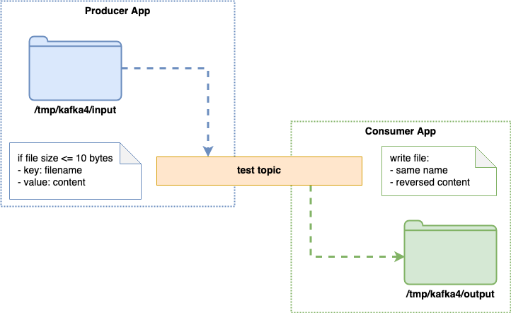

# Session 4

- Kafka Quiz
- Testing Kafka applications
- Intro to Kafka Streams

## Questions

- **Message size** 
    - Out of the box, the Kafka brokers can handle messages up to 1MB 
    (in practice, a little bit less than 1MB) 
    with the default configuration settings 
    - Kafka is optimized for small messages of about 1K in size. 
- **Testing Kafka Applications**
    - covered in this session
    
## Quiz

- Take out your smartphones and follow instructions.

## Testing Kafka Applications

* Kafka is an infrastructure element, like a database.

| Scenario | Database aspect | Kafka aspect |
| -------- | :-------------: | :----------: |
| Test the tooling | - | - |
| In memory | In memory DB | [Spring Kafka Test](https://blog.mimacom.com/testing-apache-kafka-with-spring-boot/), [Kafka Streams Test Utils](https://kafka.apache.org/21/documentation/streams/developer-guide/testing.html) |
| Dockerized environment | DB running in Docker | Kafka/ZK running in Docker |
| Dev environment | Dedicated db/table | Dedicated topic |
| Dev env - live table | Delete test record | - |
| Truncate | Truncate table | Set retention.ms to 1, wait, set it back |
| Integration Test | Check database values | Check messages ? (async) |

### Demo Application

How to test it?

.

.

.

.

.

* Unit test for the producer logic
* Unit test for the consumer logic
* Integration test - how to deal with the async nature of Kafka?

Demo:
* [Source code](kafka4/src/main/java/org/example)
* [Test code](kafka4/src/test/java/org/example/AppTest.java)
    
## Intro to Kafka Streams

* [Kafka Streams as a Consumer](kafka4/src/main/java/org/example/StreamsApp.java)

## Plans for the next session
- Kafka Quiz (postponed from this session)
- Spring Kafka Test
- Kafka Streams in more detail (?)
