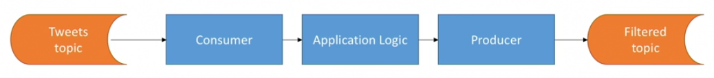
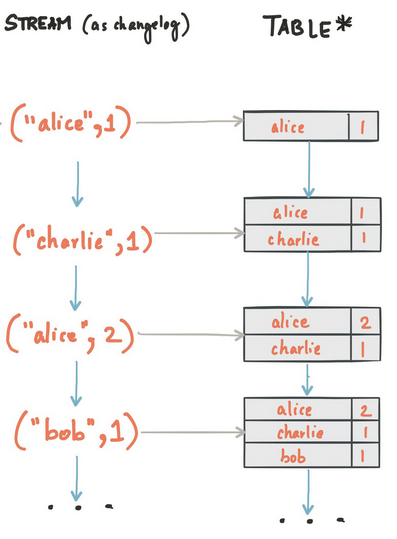

# Introduction to Kafka Streams

## Concept

* Easy data processing and transformation library with Kafka.
* Combines consumer(s) with producer(s).



### Stream

* An unbounded stream of events in Kafka.
* It maps to a Kafka topic, each message in the topic is a stream element.

### Table

* In its simplest form it is a list of (key, value) pairs.
* It can get updates - entries with the same key "overwrite" the previous record.
* Represent the current state.
* A Kafka topic can be mapped to a table - the table will hold the latest value for every key. 



## Demo

```bash
# Create topics
kafka-topics --bootstrap-server localhost:9092 --create --topic entity \
    --partitions 1 --replication-factor 1 
kafka-topics --bootstrap-server localhost:9092 --create --topic country \
    --partitions 1 --replication-factor 1 
kafka-topics --bootstrap-server localhost:9092 --create --topic enriched \
    --partitions 1 --replication-factor 1 

# Run application

# Start a consumer for the result topic
kafkacat -b localhost:9092 -C -t enriched -q

# In a different window start producing messages to the `entity` topic
./messages.sh
./messages.sh | kafkacat -b localhost:9092 -P -t entity

# In a third window start setting up country names
kafkacat -b localhost:9092 -P -t country -K ','
```
```csv
HU,Hungary
PL,Poland
```
Change Names
```csv
PL,Polska
HU,Magyarország
```

You can also try to introduce incorrect values to the `entity` topic - 
they should be routed to the `incorrect` topic.

## Homework

Watch the following video (4 mins):
* [Kafka Streams Introduction](https://www.linkedin.com/learning/learn-apache-kafka-for-beginners/kafka-streams-introduction?autoplay=true&u=2113185)

Read this article:
* [Streams and Tables in Apache Kafka](https://www.confluent.io/blog/kafka-streams-tables-part-1-event-streaming/)
